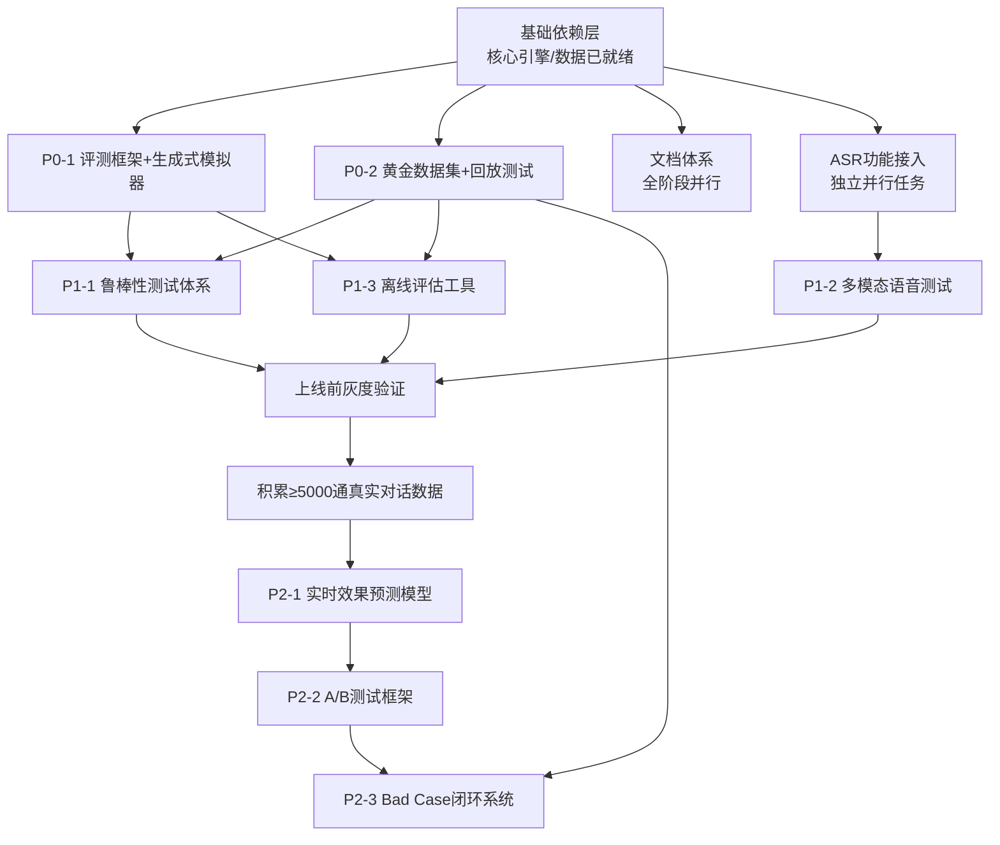

# 🚀 项目路线规划与TODO总览
> 本文档记录项目整体发展路线、详细任务拆解、依赖关系，持续更新。

---

## 🎯 项目核心目标
面向印尼信贷市场的全流程智能语音催收系统，覆盖宽限期提醒（H2/H1）到实质性逾期催收（S0）全催收阶段，用AI替代80%以上人工重复性工作，在保证回款率不低于人工80%的前提下，降低60%人力成本，实现催收流程标准化、数字化、智能化。

---

## 📊 整体发展阶段
| 阶段 | 状态 | 核心目标 |
|------|------|----------|
| **MVP验证** | ✅ 已完成 | 核心对话引擎、语音能力打通，基础场景成功率85%+ |
| **能力增强** | 🔄 进行中 | 完善评估体系、鲁棒性、ASR接入，具备上线前所有验证能力 |
| **生产落地** | ⏳ 规划中 | 接入真实SIP线路，灰度上线，大规模部署 |
| **迭代优化** | ⏳ 长期 | 数据驱动闭环迭代，效果持续提升 |

---

## 📋 详细任务拆解与依赖关系
### 基础依赖层（✅ 已就绪，所有任务的根依赖）
> 所有后续任务均基于以下已完成资产构建，无前置依赖：
> - 核心12状态对话引擎、LLM Fallback混合架构
> - TTS/VAD/智能打断全链路能力
> - FastAPI服务框架、数据库持久化
> - 1130条标注对话数据、77条转写真实对话
> - 历史催收业务标签库

---

### 🔹 P0 紧急任务（1-2周，当前开发测试刚需，可并行执行）
| 子模块 | 事项ID | 具体内容 | 前置依赖 | 状态 |
|--------|--------|----------|----------|------|
| **评测框架重构** | P01-01 | 拆解旧`core/evaluation.py`硬编码逻辑，抽离通用可插拔评测接口 | 基础依赖层就绪 | ✅ 已完成 |
| | P01-02 | 从真实对话提取用户行为特征：分阶段回复模式、抗拒策略、印尼口语特征 | 基础依赖层就绪 | ✅ 已完成 |
| | P01-03 | 实现数据驱动生成式客户模拟器，支持用户类型、抗拒等级、场景参数调节 | P01-02完成 | ✅ 已完成 |
| | P01-04 | 定义多维度评估指标体系：效率类、体验类、合规类共12个核心指标 | P01-01完成 | ✅ 已完成 |
| | P01-05 | 将生成式客户模拟器适配到新的通用评测接口 | P01-01、P01-03完成 | ✅ 已完成 |
| | P01-06 | 升级`tests/run_small_scale_test.py`，支持多维度下钻统计，自动生成结构化评测报告 | P01-04、P01-05完成 | ✅ 已完成 |
| | P01-07 | 兼容性验证：原有规则化测试用例可无修改正常运行 | P01-06完成 | ✅ 已完成 |
| **真实对话回放测试** | P02-01 | 标注77条已转写真实对话，补充催收阶段、最终结果、关键节点标记 | 基础依赖层就绪 | 🚧 进行中 |
| | P02-02 | 补充标注剩余123条语音转写结果，构建≥200条覆盖全场景的黄金测试数据集 | P02-01完成 | 📝 待开始 |
| | P02-03 | 实现对话回放引擎：按顺序输入真实用户回复，驱动机器人执行完整对话流程 | 基础依赖层就绪 | ✅ 已完成 |
| | P02-04 | 实现结果对比逻辑：自动对比机器人最终结果、关键节点应对是否符合标注预期 | P02-02、P02-03完成 | ✅ 已完成 |
| | P02-05 | 实现回归测试脚本：支持批量运行所有黄金用例，自动输出失败案例报告 | P02-04完成 | 📝 待开始 |
| | P02-06 | 集成到CI/CD流程：代码提交自动触发回放回归测试 | P02-05完成 | 📝 待开始 |
| **语音链路打通** | P03-01 | 安装TTS/ASR依赖：edge-tts、faster-whisper、sounddevice | 基础依赖层就绪 | ✅ 已完成 |
| | P03-02 | 新建`src/core/voice/asr.py`：封装Faster-Whisper实时识别，支持印尼语，流式识别 | P03-01完成 | ✅ 已完成 |
| | P03-03 | 新建`src/core/voice/audio_io.py`：麦克风录音+扬声器播放，与VAD联动 | P03-01完成 | ✅ 已完成 |
| | P03-04 | 新建`src/core/voice/conversation.py`：串联麦克风→VAD→ASR→纠错→Chatbot→TTS→扬声器全链路 | P03-02、P03-03完成 | ✅ 已完成 |
| | P03-05 | 语音模式接入Demo：start_demo.py增加语音模式入口 | P03-04完成 | 📝 待开始 |

---

### 🔹 P1 高优任务（3-4周，上线前必须完成，依赖P0全量完成）
| 子模块 | 事项ID | 具体内容 | 前置依赖 |
|--------|--------|----------|----------|
| **鲁棒性测试体系** | P11-01 | 梳理高风险场景分类：恶意对抗类、极端抗拒类、逻辑陷阱类、异常输入类 | P0全量完成 |
| | P11-02 | 编写≥100条鲁棒性测试用例，覆盖所有高风险场景，标注预期处理结果 | P11-01完成 |
| | P11-03 | 实现自动化测试执行引擎：批量运行所有测试用例，记录执行过程和结果 | P01-07、P11-02完成 |
| | P11-04 | 构建合规检查规则库：敏感词、违规话术、禁止表述检测规则 | P11-03完成 |
| | P11-05 | 实现鲁棒性测试报告生成：自动统计通过率、识别合规风险、标记失败案例根因 | P11-04完成 |
| **多模态语音仿真测试** | P12-01 | 梳理印尼常见口音、背景噪音场景分类（马路/市场/家庭/多人说话等） | ASR功能接入完成 |
| | P12-02 | 构建语音测试数据集：收集不同口音、不同噪音场景下的真实用户语音样本 | P12-01完成 |
| | P12-03 | 实现语音模拟层：支持加载语音样本、模拟不同语速/音量/噪音叠加效果 | P12-02完成 |
| | P12-04 | 打通全链路测试流程：语音输入→ASR识别→对话引擎处理→TTS合成输出→全流程记录 | P12-03、ASR集成完成 |
| | P12-05 | 实现语音链路指标统计逻辑：ASR识别准确率、端到端响应延迟、打断时机准确率、TTS可懂度检测 | P12-04完成 |
| | P12-06 | 实现批量语音测试工具，自动生成语音链路质量报告 | P12-05完成 |
| **离线合成对照评估** | P13-01 | 梳理历史人工催收特征库：逾期阶段、欠款金额、用户画像、历史还款记录等20+维特征 | P0全量完成、历史业务数据就绪 |
| | P13-02 | 实现倾向性得分匹配（PSM）算法：将机器人测试用户与历史人工催收用户做1:1特征精确匹配 | P13-01完成 |
| | P13-03 | 实现效果对比逻辑：对比匹配组的回款率差异，计算95%置信区间 | P13-02完成 |
| | P13-04 | 实现离线评估报告生成：输出机器人相对人工的效果提升率、分群体效果差异 | P13-03完成 |
| | P13-05 | 准确性验证：用已知效果的历史对话验证评估结果与真实效果相关性≥85% | P13-04完成 |

---

### 🔹 P2 长期任务（上线后迭代，依赖P1全量完成、积累≥5000通真实对话）
| 子模块 | 事项ID | 具体内容 | 前置依赖 |
|--------|--------|----------|----------|
| **实时效果预测模型** | P21-01 | 特征工程：从对话日志、用户特征、催收阶段、话术类型等维度提取100+预测特征 | 已积累≥5000通带回款标签的真实对话 |
| | P21-02 | 构建训练样本集：清洗标注对话数据，划分训练/验证/测试集 | P21-01完成 |
| | P21-03 | 训练二分类预测模型，调参优化至AUC≥0.88，预测准确率≥85% | P21-02完成 |
| | P21-04 | 模型部署为实时预测接口，单通对话打分延迟<100ms | P21-03完成 |
| | P21-05 | 效果验证：预测结果与真实回款结果相关性≥85% | P21-04完成 |
| **A/B测试框架** | P22-01 | 实现流量分流模块：支持按比例分配流量到不同版本，保证用户特征分布均衡 | P21-05完成 |
| | P22-02 | 实现版本管理模块：支持多版本机器人/催收策略并行上线 | P22-01完成 |
| | P22-03 | 实现效果自动对比逻辑：统计不同版本核心指标，自动执行显著性检验 | P22-02完成 |
| | P22-04 | 实现A/B测试报告生成：自动输出对比结论，判断版本效果是否统计显著提升 | P22-03完成 |
| | P22-05 | 实现灰度发布支持：支持小流量放量、逐步扩大流量比例、异常自动回滚 | P22-04完成 |
| **Bad Case闭环系统** | P23-01 | 实现bad case自动识别规则：基于实时预测低分、对话异常特征标记问题对话 | P21-05、P22-05完成 |
| | P23-02 | 实现bad case聚类算法：自动识别共性问题类型（话术问题/状态机逻辑问题/ASR识别问题等） | P23-01完成 |
| | P23-03 | 实现优化建议生成：针对不同聚类的问题，自动输出对应优化方向 | P23-02完成 |
| | P23-04 | 实现bad case管理后台：支持标注、跟进优化状态、关联优化版本 | P23-03完成 |
| | P23-05 | 实现闭环回流机制：优化后的版本自动触发回归测试，验证问题是否解决 | P23-04、P02-06完成 |

---

## 🔗 总体任务依赖关系

---

## 📚 文档完善任务（全阶段可并行执行）
| 事项ID | 具体内容 | 前置依赖 | 状态 |
|--------|----------|----------|------|
| DOC-01 | 重写根目录`README.md`，更新项目目标、技术路线、核心能力、快速开始指南 | 基础依赖层就绪 | ✅ 已完成 |
| DOC-02 | 完善`docs/evaluation/EVALUATION_FRAMEWORK.md`，更新评估方案和工具列表 | P0全量完成 | ✅ 已完成 |
| DOC-03 | 编写`docs/evaluation/SIMULATOR_GUIDE.md`：生成式模拟器参数说明、使用指南 | P01-07完成 | ✅ 已完成 |
| DOC-14 | 编写`docs/evaluation/BULK_TEST_GUIDE.md`：批量测试工具使用说明、参数配置指南 | P01-06完成 | ✅ 已完成 |
| DOC-04 | 编写`docs/evaluation/PLAYBACK_TEST_GUIDE.md`：回放测试工具使用说明、黄金数据集说明 | P02-06完成 | 📝 待开始 |
| DOC-05 | 编写`docs/evaluation/ROBUSTNESS_TEST_GUIDE.md`：鲁棒性测试用例说明、工具使用指南 | P11-05完成 | 📝 待开始 |
| DOC-06 | 编写`docs/evaluation/OFFLINE_EVALUATION_GUIDE.md`：离线效果评估工具使用说明 | P13-05完成 | 📝 待开始 |
| DOC-07 | 编写`docs/design/CHATBOT_DESIGN.md`：12状态对话引擎设计、状态流转说明 | 基础依赖层就绪 | 📝 待开始 |
| DOC-08 | 优化`docs/design/03-llm-fallback.md`：更新兜底触发规则、切换逻辑说明 | 基础依赖层就绪 | 📝 待开始 |
| DOC-09 | 编写`docs/design/SPEECH_LINK_DESIGN.md`：TTS/VAD/ASR/打断全链路设计说明 | ASR接入完成 | 📝 待开始 |
| DOC-10 | 优化`docs/design/05-user-profile-templating.md`：用户画像、话术模板设计说明 | 基础依赖层就绪 | 📝 待开始 |
| DOC-11 | 自动生成API接口文档，保持与代码同步更新 | 基础依赖层就绪 | 📝 待开始 |
| DOC-12 | 编写生产环境部署文档：依赖安装、配置、高可用部署方案 | P1全量完成 | 📝 待开始 |
| DOC-13 | 编写运营操作手册：话术配置、策略调整、报表查看说明 | P1全量完成 | 📝 待开始 |

## 📌 历史规划归档
### 红黑对抗训练框架后续方向（已整合到新路线）
#### 1. 强化学习优化
**描述：** 使用强化学习根据对话反馈动态调整话术策略
- 每次成功/失败都作为奖励信号
- 策略网络学习最优话术组合
- 参考论文：RL for Dialogue Systems

#### 2. 多维度个性化
**描述：** 更细粒度的个性化策略
- **情感分析驱动** - 实时分析客户情绪（愤怒/不耐烦/犹豫）
  - 愤怒 → 安抚策略
  - 不耐烦 → 精简策略
  - 犹豫 → 推动策略
- **会话上下文记忆** - 跨多轮对话记住关键信息
  - 家庭情况
  - 困难原因
  - 之前承诺
