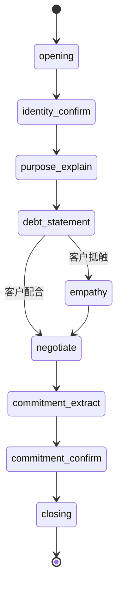

# 实验总结报告模板

## 执行摘要

### 实验概述
- **数据量**: XX 条语音对话
- **时间范围**: YYYY-MM 至 YYYY-MM
- **目标**: 从真实对话中发现会话状态、识别有效话术

### 核心发现
1. **会话状态**: 发现 XX 个核心状态（见下文）
2. **有效话术**: 识别出 XX 个高提升率话术
3. **关键路径**: 成功案例的典型路径是...
4. **最佳实践**: ...

---

## 一、会话状态发现结果

### 1.1 发现的状态列表

| State ID | 名称 | 出现频率 | 说明 |
|----------|------|---------|------|
| opening | 开场问候 | 100% | 每次对话都有 |
| identity_confirm | 身份确认 | 95% | 确认对方身份 |
| ... | ... | ... | ... |

### 1.2 状态转移图

### 1.3 关键状态洞察
- **状态X**: 这是转折点，80%成功案例经过此状态
- **状态Y**: 危险状态，进入此状态后成功率下降30%
- ...

---

## 二、话术分析结果

### 2.1 Top 10 有效话术（提升率排序）

| 排名 | 话术（印尼文） | 提升率 | p值 | 适用场景 |
|------|---------------|--------|-----|---------|
| 1 | "Kapan Bapak/Ibu bisa bayar?" | +22% | 0.001 | 引导承诺 |
| 2 | "Saya mengerti situasinya, tapi..." | +18% | 0.003 | 共情后施压 |
| ... | ... | ... | ... | ... |

### 2.2 应该避免的话术

| 话术 | 提升率 | 原因 |
|------|--------|------|
| "Anda harus bayar SEKARANG!" | -15% | 过于强硬 |
| ... | ... | ... |

### 2.3 话术风格最佳实践
- ✅ **多提问，引导客户思考**
- ✅ **共情 + 引导**的组合效果最好
- ❌ **避免一开始就高强度施压**
- ...

---

## 三、对话模式发现

### 3.1 成功案例的对话特征
- 平均通话时长: 4.2分钟
- 催收员说话占比: 45%（倾听更多）
- 平均打断次数: 2.1次
- 获得明确承诺率: 85%

### 3.2 关键转折点
- **时间点**: 对话进行到60-90秒时
- **表现**: 客户从抵触开始松动
- **触发**: 催收员使用了共情话术

---

## 四、对产品设计的建议

### 4.1 对话状态机设计
建议采用我们发现的XX个状态，状态转移规则见...

### 4.2 话术库初始化
建议直接使用Top 50有效话术作为初始话术库

### 4.3 打断策略
- 在客户说话超过X秒且离题时打断
- 避免在客户情绪激动时打断
- ...

---

## 五、后续实验建议

1. **扩大数据规模** - 验证当前发现的泛化性
2. **细分人群实验** - 不同风险/人群的有效话术差异
3. **A/B测试验证** - 在线上测试这些发现
4. **长期效果追踪** - 看效果是否持续
